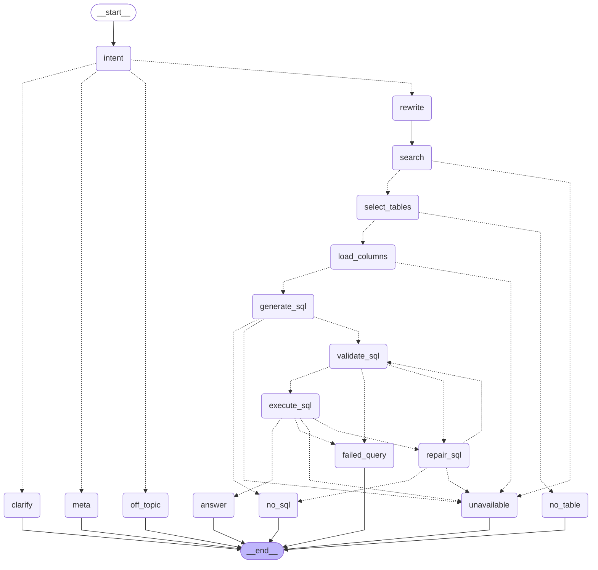

# Agent graph

Generated from `build_graph` (`graph.get_graph().draw_mermaid()`).

```mermaid
---
config:
  flowchart:
    curve: linear
---
graph TD;
	__start__([<p>__start__</p>]):::first
	intent(intent)
	rewrite(rewrite)
	search(search)
	select_tables(select_tables)
	load_columns(load_columns)
	generate_sql(generate_sql)
	repair_sql(repair_sql)
	validate_sql(validate_sql)
	execute_sql(execute_sql)
	answer(answer)
	no_table(no_table)
	no_sql(no_sql)
	failed_query(failed_query)
	unavailable(unavailable)
	clarify(clarify)
	meta(meta)
	off_topic(off_topic)
	__end__([<p>__end__</p>]):::last
	__start__ --> intent;
	execute_sql -.-> answer;
	execute_sql -.-> failed_query;
	execute_sql -.-> unavailable;
	execute_sql -.-> repair_sql;
	generate_sql -.-> no_sql;
	generate_sql -.-> unavailable;
	generate_sql -.-> validate_sql;
	intent -.-> clarify;
	intent -.-> meta;
	intent -.-> off_topic;
	intent -.-> rewrite;
	load_columns -.-> generate_sql;
	load_columns -.-> unavailable;
	repair_sql -.-> no_sql;
	repair_sql -.-> unavailable;
	repair_sql -.-> validate_sql;
	rewrite --> search;
	search -.-> select_tables;
	search -.-> unavailable;
	select_tables -.-> load_columns;
	select_tables -.-> no_table;
	validate_sql -.-> execute_sql;
	validate_sql -.-> failed_query;
	validate_sql -.-> repair_sql;
	answer --> __end__;
	clarify --> __end__;
	failed_query --> __end__;
	meta --> __end__;
	no_sql --> __end__;
	no_table --> __end__;
	off_topic --> __end__;
	unavailable --> __end__;
	classDef default fill:#f2f0ff,line-height:1.2
	classDef first fill-opacity:0
	classDef last fill:#bfb6fc
```
